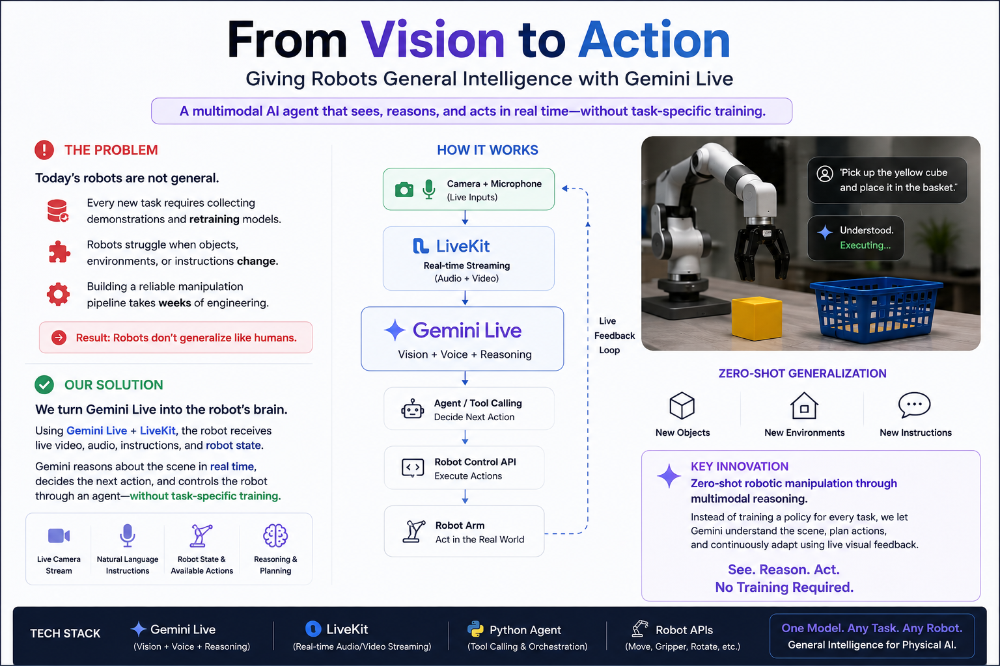

# Gemini + LiveKit Integration

How Gemini 3.1 Flash Audio and LiveKit Agents 1.6.4 are wired together in RAX.



---

## Stack

| Layer | Library | Version | Role |
|-------|---------|---------|------|
| Real-time transport | `livekit` | ≥ 1.1 | WebRTC room, tracks, participants |
| Agent framework | `livekit-agents` | 1.6.4 | `AgentServer`, `AgentSession`, tool dispatch |
| LLM plugin | `livekit-plugins-google` | 1.6.4 | `google.realtime.RealtimeModel` |
| Model | Gemini 3.1 Flash Audio | `gemini-3.1-flash-audio-eap` | Voice + vision + function calling |
| Python | — | ≥ 3.10 | Async runtime |

---

## How It Works

### Session lifecycle

```
participant joins LiveKit room
        │
        ▼
@server.rtc_session → entrypoint(ctx: JobContext)
        │
        ├─ AgentSession(llm=RealtimeModel(...))
        ├─ session.start(room=ctx.room, agent=GazeRobotAgent(...))
        ├─ ctx.connect()                    ← agent joins the room
        └─ session.generate_reply(...)      ← Gemini speaks first

        User speaks / shares webcam
        │
        ▼
Gemini sees + hears → decides to call a function tool
        │
        ▼
@function_tool: gaze_robot / stop_robot / robot_status
        │
        ▼
GazeEngine runs in background thread via run_in_executor
```

### RealtimeModel

```python
from livekit.plugins import google

llm = google.realtime.RealtimeModel(
    model="gemini-3.1-flash-audio-eap",
    voice="Aoede",           # Aoede, Puck, Charon, Kore, Fenrir
)
```

`RealtimeModel` opens a persistent bidirectional WebSocket to the Gemini Live API.
Audio from the LiveKit room flows in, Gemini's spoken response flows out — all handled
by the livekit-agents framework transparently.

### AgentSession

```python
session = AgentSession(llm=llm)
await session.start(room=ctx.room, agent=MyAgent(room=ctx.room))
await ctx.connect()
```

`AgentSession` owns the turn-taking loop: VAD, interruptions, tool dispatch, and
routing Gemini's audio output back to the room as a published audio track.

### Function tools

```python
class MyAgent(Agent):
    @function_tool()
    async def my_tool(self, context: RunContext, param: str) -> str:
        ...
        return "result string back to Gemini"
```

The `RunContext` gives access to the current session, participant, and room inside
the tool handler. Return a plain string — Gemini reads it and continues the
conversation.

### Agent lifecycle hook

```python
async def on_enter(self) -> None:
    # called when the agent enters the session
    # set up executor, start background tasks here
    ...
```

`on_enter` replaces `on_session_start` (deprecated name in older docs).

---

## Video: publishing the robot camera

The robot's OAK-D left frame is published as a custom `VideoSource`:

```python
source = rtc.VideoSource(width=W, height=H)
track  = rtc.LocalVideoTrack.create_video_track("robot-eye", source)
opts   = rtc.TrackPublishOptions(source=rtc.TrackSource.SOURCE_CAMERA)
await room.local_participant.publish_track(track, opts)

# each frame:
vf = rtc.VideoFrame(width=W, height=H, type=rtc.VideoBufferType.RGBA, data=rgba.tobytes())
source.capture_frame(vf)
```

OpenCV BGR frames are converted to RGBA before capture. The track is identified by
name `"robot-eye"` so the frontend can subscribe specifically to it.

---

## Credentials & Environment

The agent loads credentials from `.env.local` at startup via `python-dotenv`:

```python
from dotenv import load_dotenv
load_dotenv(".env.local")
```

Required variables (see also [livekit_gaze_agent.md](livekit_gaze_agent.md)):

```bash
LIVEKIT_URL=wss://your-project.livekit.cloud
LIVEKIT_API_KEY=APIxxxxxxxxxx
LIVEKIT_API_SECRET=xxxxxxxxxxxxxxxx
GOOGLE_API_KEY=AIzaxxxxxxxxxxxxxxx
```

The `livekit-agents` worker reads `LIVEKIT_URL`, `LIVEKIT_API_KEY`, and
`LIVEKIT_API_SECRET` directly from the environment; they do **not** need to be
passed to any constructor.

---

## Development mode

```bash
python -m agents.livekit_gaze_agent dev
# or via the launcher:
./run_livekit_gaze.sh dev
```

`dev` mode connects the agent to your LiveKit Cloud project and waits for a
participant. In production use `start` instead.

### LiveKit CLI (optional)

```bash
pip install livekit-cli
lk agent dev --url $LIVEKIT_URL --api-key $LIVEKIT_API_KEY --api-secret $LIVEKIT_API_SECRET
```

---

## Packages

Install all LiveKit + Gemini dependencies:

```bash
pip install -r agents/requirements_livekit.txt
```

Contents of `requirements_livekit.txt`:

```
livekit-agents[google]>=0.13   # AgentServer, AgentSession, Agent, function_tool
livekit>=0.18                  # rtc.Room, rtc.VideoSource, rtc.LocalVideoTrack
python-dotenv>=1.0
numpy>=1.24
opencv-python>=4.8
scipy>=1.11
google-genai>=1.0              # bundled via livekit-agents[google]
```

The `[google]` extra installs `livekit-plugins-google` which provides
`livekit.plugins.google.realtime.RealtimeModel`.

---

## Useful Links

- [LiveKit Agents docs](https://docs.livekit.io/agents/)
- [LiveKit Cloud dashboard](https://cloud.livekit.io)
- [Google AI Studio (API keys)](https://aistudio.google.com/apikey)
- [Gemini Live API reference](https://ai.google.dev/gemini-api/docs/live)
- [AIEWF Hackathon 2026 LiveKit prize](https://livekit.io/blog/aiewf-hackathon-2026)
